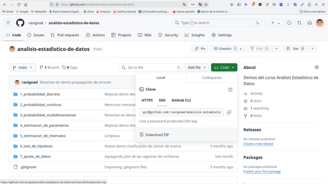

## Instalación de las demos

1. Abrir el repository https://github.com/ravignad/analisis-estadistico-de-datos en un navegador y bajar el archivo analisis-estadistico-de-datos-main.zip

2. Mover analisis-estadistico-de-datos-main.zip a una carpeta y descomprimir
   
 `cd ~`
 
`unzip analisis-estadistico-de-datos-main`

3. Crear un entorno virtual Python dentro del directorio analisis-estadistico-de-datos-main

`cd analisis-estadistico-de-datos-main`

`python3 -m venv venv`

4. Activar el entorno virtual

`source venv/activate/bin`

5. Instalar las dependencias dentro del entorno virtual:

`(venv) python3 -m pip install -r requirements.txt`

6. Crear el kernel Jupyter analisis-datos

`(venv) python3 -m ipykernel install --prefix=./venv --name=aed_demos --display_name "Demos Análisis Datos"`

## Ejecución de las demos

1. Ir al directorio de las demos

`cd analisis-estadistico-de-datos-main`

2. Activar el entorno virtual

`source venv/activate/bin`

3. Correr una demo
 
`jupyter notebook 1_probabilidad_discreta/cumpleanos.ipynb`

